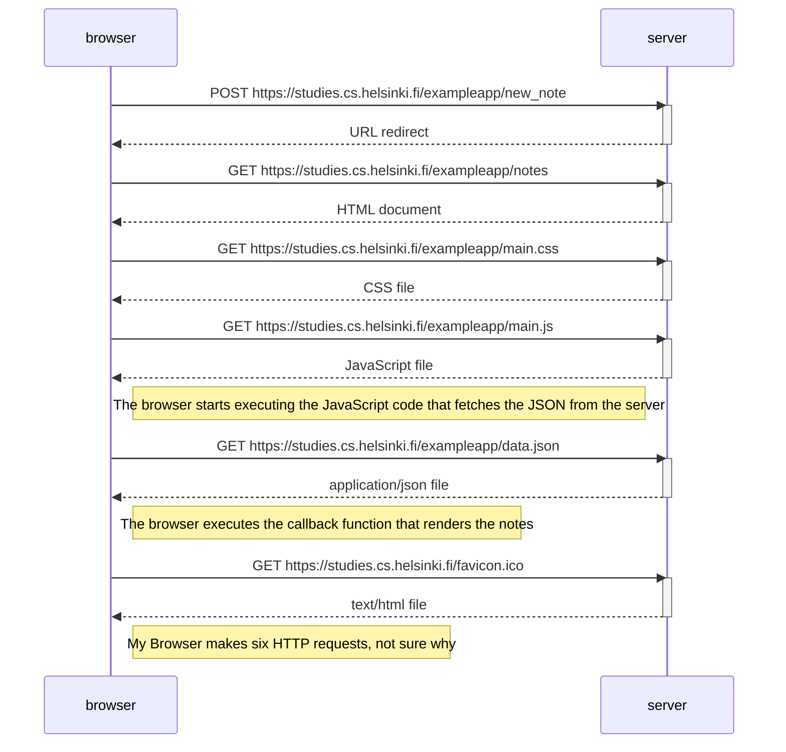

### exercise 0.4

```mermaid
sequenceDiagram
  browser->>server: POST https://studies.cs.helsinki.fi/exampleapp/new_note;
  activate server;
  server-->>browser: URL redirect;
  deactivate server;

  browser->>server: GET https://studies.cs.helsinki.fi/exampleapp/notes;
  activate server;
  server-->>browser: HTML document;
  deactivate server;

  browser->>server: GET https://studies.cs.helsinki.fi/exampleapp/main.css;
  activate server;
  server-->>browser: CSS file;
  deactivate server;

  browser->>server: GET https://studies.cs.helsinki.fi/exampleapp/main.js;
  activate server;
  server-->>browser: JavaScript file;
  deactivate server;

  Note right of browser: The browser starts executing the JavaScript code that fetches the JSON from the server;

  browser->>server: GET https://studies.cs.helsinki.fi/exampleapp/data.json;
  activate server;
  server-->>browser: application/json file;
  deactivate server;

  Note right of browser: The browser executes the callback function that renders the notes;

  browser->>server: GET https://studies.cs.helsinki.fi/favicon.ico;
  activate server;
  server-->>browser: text/html file
  deactivate server;

  Note right of browser: My Browser makes six HTTP requests, not sure why;
```
