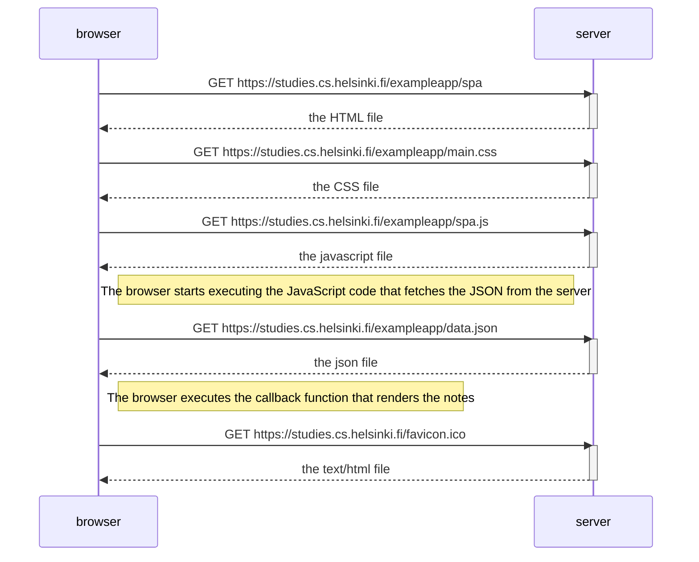

### exercise 0.5

```mermaid
sequenceDiagram
  browser->>server: GET https://studies.cs.helsinki.fi/exampleapp/spa;
  activate server;
  server-->>browser: the HTML file;
  deactivate server;

  browser->>server: GET https://studies.cs.helsinki.fi/exampleapp/main.css
  activate server;
  server-->>browser: the CSS file;
  deactivate server;

  browser->>server: GET https://studies.cs.helsinki.fi/exampleapp/spa.js
  activate server;
  server-->>browser: the javascript file;
  deactivate server;

  Note right of browser: The browser starts executing the JavaScript code that fetches the JSON from the server;

  browser->>server: GET https://studies.cs.helsinki.fi/exampleapp/data.json
  activate server;
  server-->>browser: the json file;
  deactivate server;

  Note right of browser: The browser executes the callback function that renders the notes

  browser->>server: GET https://studies.cs.helsinki.fi/favicon.ico
  activate server;
  server-->>browser: the text/html file;
  deactivate server;
```
